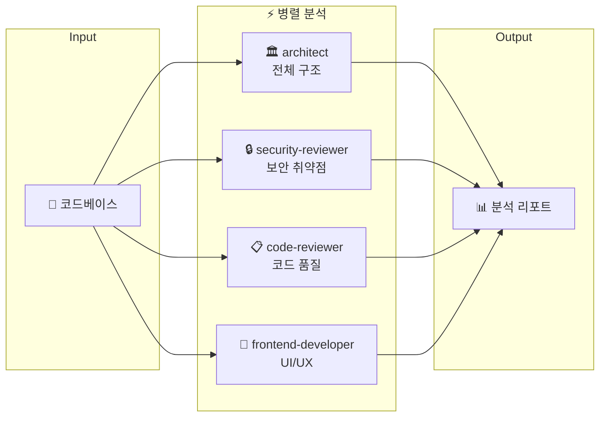

# 🎓 Claude Code Power Pack 이해하기

## 📌 한 줄 요약
> Claude Code를 더 똑똑하게 만들어주는 **스킬, 에이전트, 규칙 모음집**이에요. 마치 게임 캐릭터에게 새로운 능력을 장착시켜주는 것처럼요!

## 🎯 우리가 만든 것

### 쉽게 비유하면...

**Claude Code = 스마트폰**이라고 생각해보세요.

- **Skills** = 앱 (카카오톡, 유튜브처럼 특정 기능을 하는 것)
- **Agents** = 시리/빅스비 같은 전문 비서 (특정 분야 전문가)
- **Rules** = 스마트폰 설정 (이렇게 동작해야 해! 라는 규칙)

이 저장소는 Claude Code에 **29개의 앱(스킬)**, **8명의 전문 비서(에이전트)**, **5개의 규칙**을 한 번에 설치해주는 **올인원 패키지**예요!

---

## 🖼️ 시각 자료

### 저장소 구조도


> 저장소는 크게 4개 폴더로 구성되어 있어요:
> - `skills/` - 29개의 스킬 (슬래시 명령어로 사용)
> - `agents/` - 8개의 전문 에이전트
> - `rules/` - 5개의 코딩 규칙
> - `.claude-plugin/` - 플러그인 설정 파일

### 설치 흐름도


> 설치는 딱 2단계!
> 1. 마켓플레이스 추가
> 2. 플러그인 설치
> 끝! 바로 스킬 사용 가능 🎉

---

## 🧱 핵심 개념 설명

### 개념 1: Skills (스킬)

**비유:** 스마트폰의 **앱**과 같아요!

카카오톡 앱을 열면 메시지를 보낼 수 있듯이, `/ccpp:plan` 스킬을 사용하면 작업 계획을 세울 수 있어요.

**실제 사용:**
```bash
/ccpp:plan          # 작업 계획 세우기
/ccpp:verify        # 테스트/린트 검증
/ccpp:commit-push-pr  # 커밋부터 PR까지 자동화
```

**왜 필요해요?**
매번 같은 작업을 반복하는 대신, 스킬 하나로 자동화할 수 있어요. 시간 절약!

---

### 개념 2: Agents (에이전트)

**비유:** 회사의 **전문 팀원**과 같아요!

- `frontend-developer` = 프론트엔드 전문가
- `code-reviewer` = 코드 리뷰 전문가
- `junior-mentor` = 주니어 교육 전문가

**실제 사용:**
```
"frontend-developer 에이전트로 로그인 페이지 만들어줘"
"code-reviewer로 이 PR 검토해줘"
"junior-mentor로 이 코드 설명해줘"
```

**왜 필요해요?**
일반 Claude보다 **특정 분야에 특화된** 답변을 받을 수 있어요. 마치 전문가에게 물어보는 것처럼!

---

### 개념 3: Rules (규칙)

**비유:** 회사의 **코딩 컨벤션 문서**와 같아요!

신입사원이 입사하면 "우리 회사는 이렇게 코드 짜요"라는 문서를 받잖아요? Rules가 바로 그거예요.

**포함된 규칙:**
| 파일 | 내용 |
|------|------|
| `coding-style.md` | 코드 스타일 (불변성, 파일 크기 등) |
| `git-workflow.md` | Git 브랜치 전략, 커밋 메시지 형식 |
| `testing.md` | 테스트 작성 규칙 |
| `performance.md` | 성능 최적화 가이드 |
| `security.md` | 보안 체크리스트 |

**왜 필요해요?**
Claude가 코드를 짤 때 이 규칙을 따라서 **일관된 품질**의 코드를 만들어요.

---

### 개념 4: Plugin System (플러그인 시스템)

**비유:** 앱스토어에서 앱을 설치하는 것과 같아요!

1. **마켓플레이스** = 앱스토어
2. **플러그인** = 앱
3. **설치** = 다운로드

**폴더 구조:**
```
.claude-plugin/
├── plugin.json      # 플러그인 정보 (앱 설명서)
└── marketplace.json # 마켓플레이스 등록 정보
```

---

## 📁 폴더별 설명

### `skills/` 폴더
**역할:** 슬래시 명령어로 사용할 수 있는 기능들

```
skills/
├── plan/           # /ccpp:plan - 작업 계획
├── verify/         # /ccpp:verify - 검증
├── review/         # /ccpp:review - 코드 리뷰
├── react-patterns/ # React 패턴 참조
├── nano-banana/    # 이미지 생성
└── ... (29개)
```

각 스킬 폴더 안에는 `SKILL.md` 파일이 있어요. 이 파일이 스킬의 "사용 설명서"예요!

### `agents/` 폴더
**역할:** 특정 분야 전문가 AI

```
agents/
├── planner.md           # 계획 전문가
├── frontend-developer.md # 프론트엔드 전문가
├── junior-mentor.md     # 주니어 멘토
├── code-reviewer.md     # 코드 리뷰어
├── architect.md         # 아키텍트
├── security-reviewer.md # 보안 전문가
├── tdd-guide.md         # TDD 가이드
└── stitch-developer.md  # Stitch UI 전문가
```

### `rules/` 폴더
**역할:** Claude가 따라야 할 코딩 규칙

```
rules/
├── coding-style.md  # 코딩 스타일
├── git-workflow.md  # Git 워크플로우
├── testing.md       # 테스트 규칙
├── performance.md   # 성능 가이드
└── security.md      # 보안 규칙
```

---

## 🔄 데이터 흐름

```
사용자 명령어 입력 → Claude Code가 스킬 로드 → 스킬에 정의된 대로 실행 → 결과 출력
      👆                    👆                        👆                👆
  "/ccpp:plan"      skills/plan/SKILL.md       계획 수립 로직        계획서 생성
```

### 플러그인 설치 흐름
```
1. claude plugin marketplace add leekee0905/claude-config
   └→ GitHub에서 저장소 정보 다운로드

2. claude plugin install ccpp@claude-config
   └→ skills/ 폴더의 모든 스킬이 사용 가능해짐

3. Claude Code 재시작
   └→ /ccpp:plan, /ccpp:verify 등 사용 가능!
```

---

## 🚀 병렬 에이전트 코드 분석

### 개념 이해
**비유:** 큰 프로젝트를 검사할 때, 한 명이 순서대로 하는 것보다 **여러 전문가가 동시에** 각자 분야를 검사하면 훨씬 빠르죠!

예를 들어 집을 검사할 때:
- 👷 건축가 → 구조 확인
- 🔒 보안 전문가 → 잠금장치 확인
- 🔌 전기 기사 → 배선 확인
- 🎨 인테리어 전문가 → 디자인 확인

이걸 **동시에** 진행하면 시간이 1/4로 줄어요!

### 시각 자료



> 순차 분석 vs 병렬 분석 비교!
> 여러 에이전트가 **동시에** 각자 영역을 분석하면 전체 시간이 획기적으로 단축됩니다.

### 분야별 에이전트 역할 분담
| 에이전트 | 담당 분야 | 검사 내용 |
|----------|-----------|-----------|
| `architect` | 전체 구조 | 아키텍처 패턴, 의존성, 설계 |
| `security-reviewer` | 보안 | XSS, SQL 인젝션, 인증 취약점 |
| `code-reviewer` | 코드 품질 | 가독성, 중복, 에러 처리 |
| `frontend-developer` | UI/UX | 컴포넌트 구조, 성능, 접근성 |

### 실제 사용법

**분야별 병렬 분석:**
```
"use subagents를 사용해서 이 코드베이스를 병렬로 분석해줘:
- architect: 전체 아키텍처 분석
- security-reviewer: 보안 취약점 검사
- code-reviewer: 코드 품질 리뷰"
```

**구역별 병렬 분석 (대규모 프로젝트):**
```
"use subagents를 사용해서 병렬로 분석해줘:
- 에이전트 1: src/api/ 폴더 분석
- 에이전트 2: src/components/ 폴더 분석
- 에이전트 3: src/utils/ 폴더 분석"
```

### 왜 빠를까요?

| 방식 | 3개 영역 분석 시간 |
|------|-------------------|
| 순차 분석 | ⏱️⏱️⏱️ (3배) |
| 병렬 분석 | ⏱️ (1배) |

각 에이전트가 **독립적으로 동시 실행**되기 때문에 가장 오래 걸리는 작업 시간만큼만 소요돼요!

---

## ⚠️ 초보자가 자주 하는 실수

### 실수 1: 플러그인 vs 전체 설정 혼동

```bash
# ❌ 플러그인만 설치하면 agents, rules는 안 깔려요!
claude plugin install ccpp@claude-config

# ✅ agents, rules도 필요하면 따로 복사해야 해요
curl -fsSL https://raw.githubusercontent.com/.../install.sh | bash
```

**왜?** Claude Code 플러그인 시스템은 현재 `skills`만 지원해요. agents와 rules는 수동으로 `~/.claude/` 폴더에 복사해야 해요.

### 실수 2: 명령어 오타

```bash
# ❌ plugins (복수형)
claude plugins install ...

# ✅ plugin (단수형)
claude plugin install ...
```

### 실수 3: 마켓플레이스 추가 안 함

```bash
# ❌ 바로 설치하려고 하면 에러!
claude plugin install ccpp@claude-config

# ✅ 먼저 마켓플레이스 추가해야 해요
claude plugin marketplace add leekee0905/claude-config
claude plugin install ccpp@claude-config
```

---

## 🎮 직접 실험해보기

### 실험 1: 스킬 목록 확인
Claude Code에서 `/`를 입력하고 `ccpp`를 쳐보세요. 사용 가능한 스킬 목록이 나와요!

### 실험 2: 간단한 스킬 사용
```
/ccpp:plan 로그인 기능 만들기
```
→ 자동으로 계획서가 만들어져요!

### 실험 3: 에이전트 사용
```
"junior-mentor 에이전트로 React useState 설명해줘"
```
→ 쉬운 비유와 함께 설명 + EXPLANATION.md까지!

### 실험 4: 이미지 생성 (nano-banana)
```
/ccpp:nano-banana 로그인 플로우 다이어그램 만들어줘
```
→ 시각적인 다이어그램이 생성돼요!

---

## 📚 더 배우고 싶다면

| 주제 | 링크 |
|------|------|
| Claude Code 공식 문서 | https://docs.anthropic.com/claude-code |
| Skills 작성법 | SKILL.md 파일 형식 참고 |
| Boris Cherny 팁 | README.md의 "Boris Cherny 팁" 섹션 |

---

## 📊 현재 저장소 통계

| 항목 | 개수 | 설명 |
|------|------|------|
| Skills | 29개 | 워크플로우 13 + 기술 10 + E2E/Stitch 5 + 이미지 1 |
| Agents | 8개 | 전문 분야별 AI 에이전트 |
| Rules | 5개 | 코딩 컨벤션 및 규칙 |

---

*이 문서는 junior-mentor 에이전트가 자동 생성했습니다* 🎓
